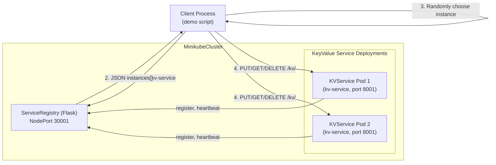

## Goal

Design how to add a **key-value store microservice** with **two instances** running in Kubernetes/Minikube, **registering with the existing registry**, and a **client process** that uses the registry (via HTTP, deployed into the cluster or run from your machine with port-forwarding) to discover and call a **random instance** for simple `PUT` and `DELETE` key operations.

## Existing Components to Reuse

- **Service registry**: `service_registry_improved.py`, already exposed in Kubernetes via `registry-deployment.yaml` / NodePort 30001.
- **Service client patterns**: `ServiceClient` in `example_service.py` (registration, heartbeat, deregistration, discovery helper pattern).
- **Kubernetes setup**: `deploy-minikube.sh`, `k8s/registry-deployment.yaml`, `k8s/example-service-deployment.yaml`, plus `KUBERNETES.md` for Minikube and `kubectl` flow.

## High-Level Architecture

### Logical Architecture

### Runtime Flow Summary

- **Startup**:
  - Registry pod runs from existing manifests.
  - `kv-service` Deployment creates **2 pods**, each pod runs the **same key-value service container**.
  - Each `kv-service` pod, on startup:
    - Reads its own address (e.g., `http://<POD_IP>:8001`) using `POD_IP` env var (as already done in example services).
    - Registers with `service_registry_improved.py` under logical name `kv-service`.
    - Starts a background heartbeat loop to `/heartbeat`.
- **Discovery**:
  - The client script sends `GET /discover/kv-service` to the registry.
  - Receives a list of active instances with their `address` fields.
  - Picks a **random instance** from that list.
- **Key-value operations**:
  - The client performs `PUT /kv/<key>` (with JSON body `{ "value": <any JSON-serializable value> }`) and `DELETE /kv/<key>` against the chosen instance.
  - Optional `GET /kv/<key>` for verification.

## Detailed Design

### 1. Key-Value Store Service (Python Flask app)

- **New module**: `kv_service.py` (or similarly named).
- **Responsibilities**:
  - Maintain an **in-memory dictionary** `store: Dict[str, Any]` scoped to a single pod.
  - Expose HTTP endpoints:
    - `PUT /kv/<key>`: Upsert value.
      - Request: `Content-Type: application/json`, body: `{ "value": <any> }`.
      - Response: `{ "status": "ok", "key": <key>, "value": <value> }` with 200.
    - `GET /kv/<key>`: Retrieve value.
      - Response 200 with `{ "key": <key>, "value": <value> }` if present.
      - Response 404 with clear JSON error if not present.
    - `DELETE /kv/<key>`: Remove value.
      - Response 200 with `{ "status": "deleted", "key": <key> }` if existed.
      - Response 404 with `{ "status": "not_found", ... }` for missing key.
    - Optional `GET /health` and `GET /stats` (e.g., count of keys) for observability.
  - **Service registry integration**:
    - On startup, compute `service_name = "kv-service"`.
    - Determine `service_address` using `POD_IP` env var when running in Kubernetes, or `localhost` when running locally.
    - Use a small client helper (can adapt logic from `ServiceClient`):
      - `register()` to `/register`.
      - Background thread `send_heartbeat()` every 10s to `/heartbeat`.
      - `deregister()` on SIGTERM/SIGINT.
- **Concurrency considerations**:
  - Protect `store` with a simple `threading.Lock` if using Flask with threaded server, or rely on single-threaded debug server for the learning demo.
  - For clarity in the plan, we can add a lock but keep the code simple.

### 2. Kubernetes Deployment for Key-Value Service

- **New manifest**: `k8s/kv-service-deployment.yaml`.
- **Deployment**:
  - `kind: Deployment`, `metadata.name: kv-service`.
  - `spec.replicas: 2` to satisfy "Run 2 service instances".
  - `spec.template` container:
    - Image: reuse and extend existing Dockerfile (build as `kv-service:latest` or reuse `service-registry` image with an alternate entrypoint).
    - Ports: container port `8001` (or another service port, but keep consistent).
    - Env vars:
      - `POD_IP` via `fieldRef: status.podIP` (pattern already in `example-service-deployment.yaml`).
      - `REGISTRY_URL` defaulting to `http://service-registry:5001` (cluster-internal service name).
- **Service**:
  - `kind: Service`, `metadata.name: kv-service`.
  - `spec.type: ClusterIP` (internal within cluster; external client talks through registry’s NodePort).
  - `spec.selector.app: kv-service` target pods.
  - `spec.ports`: map port 8001.
- **Probe configuration**:
  - Liveness and readiness probes hitting `GET /health` on port 8001.

### 3. Client Demo Script (Discovery + Random Instance Calls)

- **New module**: `kv_client_demo.py`.
- **Responsibilities**:
  - Accept minimal CLI arguments, or use defaults:
    - `--registry-url` default `http://localhost:5001` (assuming you port-forward registry service from cluster).
  - Steps:
    1. **Check registry health** via `GET /health` and print status.
    2. **Discover key-value service** via `GET /discover/kv-service`.
      - Validate `count >= 1`, require `count >= 2` for the full microservice-with-discovery demo.
    3. **Pick random instance**:
      - Use Python `random.choice(instances)` on `instances` list from the registry response.
      - Extract `instance_address = instance['address']`.
    4. **Perform KV operations on chosen instance**:
      - For example, demo flow:
        - `PUT /kv/demo-key` with a small JSON payload.
        - `GET /kv/demo-key` to confirm.
        - `DELETE /kv/demo-key`.
      - Log which instance address was chosen for each operation.
    5. For extra visualization, optionally:
      - Perform the same operations multiple times, showing that on each demo run a **different instance** might be selected.
  - **Minikube integration**:
    - Instructions will tell the user to run: `kubectl port-forward service/service-registry 5001:5001` before running `kv_client_demo.py` locally.

### 4. Wiring to Minikube and kubectl

- **Docker image workflow**:
  - Reuse `deploy-minikube.sh` or document manual steps:
    - `eval $(minikube docker-env)`.
    - `docker build -t kv-service:latest .` (or tag consistent with existing Dockerfile and add argument/entrypoint to run `kv_service.py`).
- **Apply manifests**:
  - `kubectl apply -f k8s/registry-deployment.yaml` (if not already deployed).
  - `kubectl apply -f k8s/kv-service-deployment.yaml`.
  - Wait for pods to be ready.
- **Testing from outside the cluster**:
  - Port-forward registry: `kubectl port-forward service/service-registry 5001:5001`.
  - Run `python kv_client_demo.py` from your machine, which interacts with the cluster through the registry.

### 5. Architecture Diagram Deliverable

- **New file** `ARCHITECTURE_KV.md`:
  - Dedicated to the **Key-Value Microservice with Discovery**.
  - Contains a single high-level mermaid diagram (similar to the one in this plan) showing the registry, the two `kv-service` pods, and the client process using discovery and random instance selection.
  - Includes a short narrative explaining:
    - How the two pods register as `kv-service` instances and send heartbeats.
    - How the client discovers `kv-service` via the registry’s `/discover` endpoint.
    - How the client uses **random selection** for basic load balancing across instances.

## Step-by-Step Implementation Outline

- **Step 1**: Implement `kv_service.py` Flask app with `/kv/<key>` endpoints, registry registration/heartbeat/deregistration, and a Kubernetes-friendly main entrypoint that derives `service_address` from `POD_IP`.
- **Step 2**: Extend the existing `Dockerfile` (or add a minor variant) so the same image can run either the registry or the key-value service based on an environment variable or entrypoint argument.
- **Step 3**: Create `k8s/kv-service-deployment.yaml` defining a two-replica Deployment and a ClusterIP Service, wired to the correct container port and environment variables (`POD_IP`, `REGISTRY_URL`).
- **Step 4**: Implement `kv_client_demo.py` that:
  - Talks to the registry (`/health`, `/discover/kv-service`).
  - Randomly selects an instance and performs `PUT/GET/DELETE` cycles against `/kv/<key>`.
- **Step 5**: Create `ARCHITECTURE_KV.md` with the key-value microservice discovery diagram and a brief description of the flows and Kubernetes wiring.
- **Step 6**: Document the end-to-end Minikube demo flow in `KUBERNETES.md` (or a short new section) covering: starting Minikube, building images, applying manifests, port-forwarding the registry, and running `kv_client_demo.py`.

## Todos

- {"id": "kv-service-impl", "content": "Implement kv_service.py Flask app with /kv/ endpoints and registry integration (register, heartbeat, deregister)", "status": "pending"}
- {"id": "docker-integration", "content": "Wire kv_service.py into the existing Dockerfile so a single image can run either the registry or the kv service", "status": "pending"}
- {"id": "k8s-manifest-kv", "content": "Create k8s/kv-service-deployment.yaml with 2 replicas and a ClusterIP Service", "status": "pending"}
- {"id": "client-demo", "content": "Implement kv_client_demo.py that discovers kv-service via registry and calls a random instance for PUT/GET/DELETE", "status": "pending"}
- {"id": "docs-architecture", "content": "Create ARCHITECTURE_KV.md with key-value microservice with discovery diagram and explanation", "status": "pending"}
- {"id": "docs-kubernetes-demo", "content": "Document the Minikube/kubectl workflow for running the kv service and client demo", "status": "pending"}

