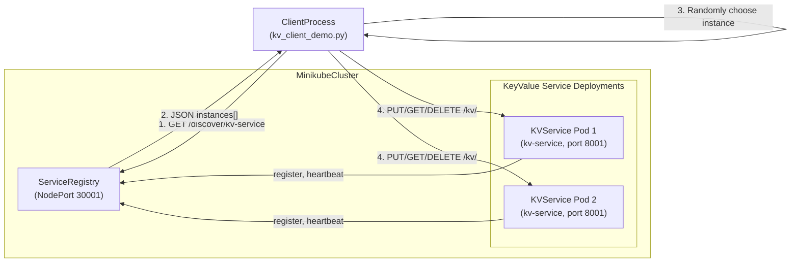

## Key-Value Microservice with Discovery

### Narrative

- Two replicas of the key-value microservice (`kv-service`) run as pods in the Minikube cluster.
- On startup, each pod:
  - Determines its address using the Kubernetes-provided `POD_IP`.
  - Registers itself with the `service-registry` under the logical name `kv-service`.
  - Sends periodic heartbeats so the registry can track active instances.
- The `kv_client_demo.py` process:
  - Calls the registry’s `/discover/kv-service` endpoint to retrieve the list of active instances.
  - Chooses a random instance from the returned `instances` list.
  - Performs a simple `PUT` → `GET` → `DELETE` cycle on `/kv/<key>` against the chosen instance to demonstrate request routing via discovery.

